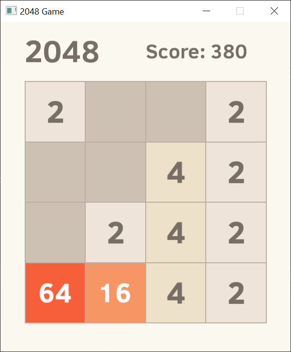
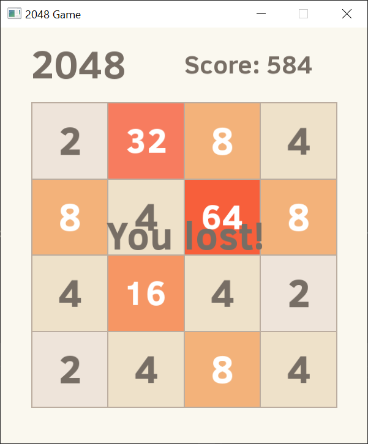

# 2048

The project is implementation of popular, puzzle game **2048**.<br />
The project was created for fun and follows the graphic design of following implementation https://play2048.co/.

## Technologies

* C++
* [SFML - Simple and Fast Multimedia Library](https://github.com/SFML/SFML)
* [Entity-x - EntityX - A fast, type-safe C++ Entity-Component system](https://github.com/alecthomas/entityx)

## Installation

### Dependencies

Install the dependencies using [microsoft/vcpkg - C++ Library Manager for Windows, Linux, and MacOS](https://github.com/microsoft/vcpkg).

```sh
$ vcpkg install sfml:x64-windows
$ vcpkg install entityx:x64-windows
```

### Repository

```sh
$ git clone https://github.com/marmal95/2048-Game.git
```

### Build

Open **Visual Studio** and **Build Project**.<br />
As code uses syntax intoduced in C\+\+20, such support should be enabled in **C++ Language Standard** in **Project Properties** inside **Visual Studio**.


### Screenshots




